# Linux容器技术 #
Docker是虚拟化的一种轻量级替代技术。Docker的容器技术不依赖任何语言、框架或系统，可以将App变成一种标准化的、可移植的、自管理的组件，并脱离服务器硬件在任何主流系统中开发、调试和运行。

1. What is a Container? 

	A standardized unit of software. Package Software into Standardized Units for Development, Shipment and Deployment
	
	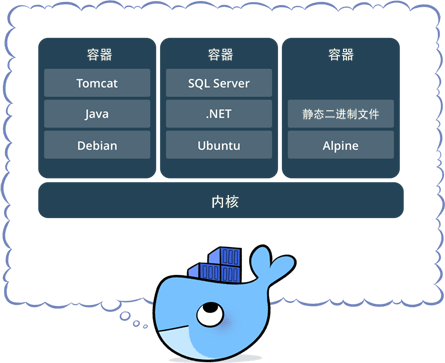

1. Docker Containers Are Everywhere: Linux, Windows, Data center, Cloud, Serverless, etc.

	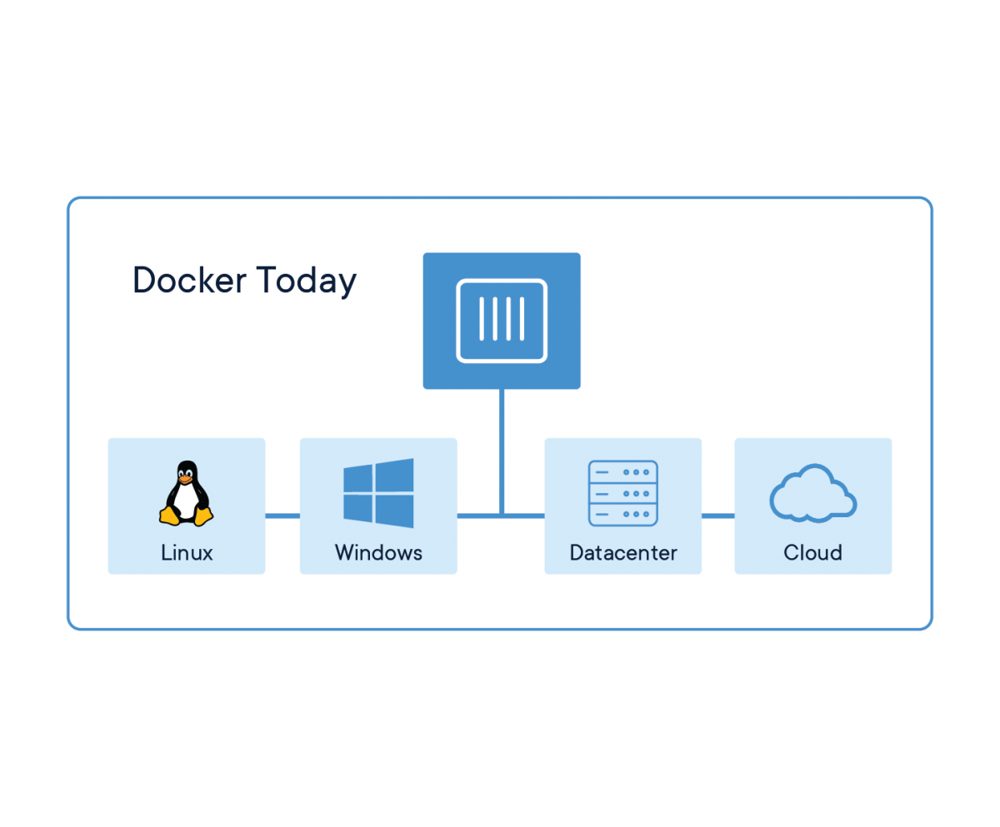

1. Comparing Containers and Virtual Machines

	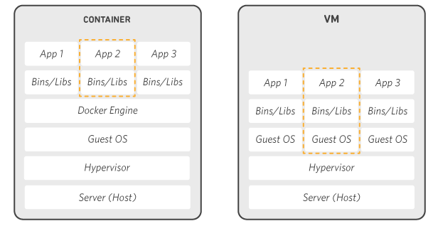

## 图解Docker

Docker架构图

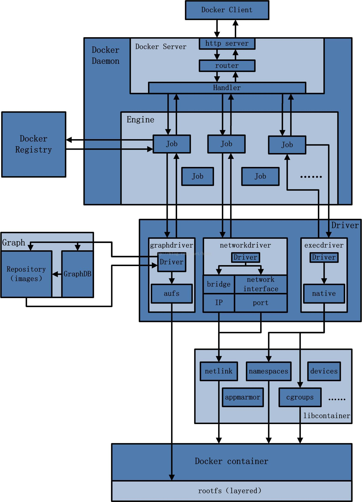

Docker思维导图

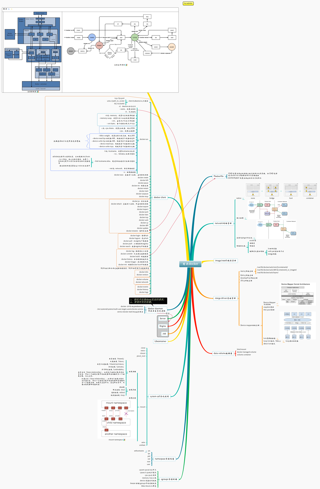

## Docker入门 - 基本命令与使用 ##

子命令分类|子命令
-----|-----
docker环境信息|info、version
容器生命周期管理|create、exec、kill、pause、restart、rm、run、start、stop、unpause
镜像仓库命令|login、logout、pull、push、search
镜像管理|build、images、import、load、rmi、save、tag、commit
容器运维操作|attach、export、inspect、port、ps、rename、stats、top、wait、cp、diff、update
容器资源管理|volume、network
系统日志信息|events、history、logs

  

info

run

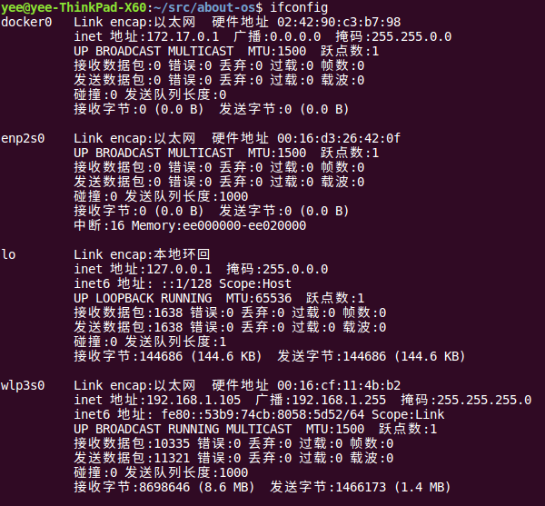

docker run创建Docker容器时，--net选项指定容器网络模式，Docker有以下4种网络模式：

- host模式，使用--net=host与主机相同，不创建独立的Network命名空间（网卡、路由、iptable规则等）；

	

- container模式，使用--net=container:NAME_or_ID，加入到指定容器使用的Network命名空间；

	

- none模式，使用--net=none，不设置网络；

	

- bridge模式，使用--net=bridge为默认模式，创建独立的Network命名空间，通过veth pair、网桥互联；
	
	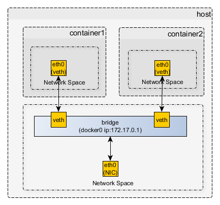

* 虚拟网卡veth、网桥等网络设备原理与实现，请参考*[Linux网络管理](./Linux网络管理.md)

pull / push

		docker pull [选项] [Docker Registry地址]<仓库名>:<标签>
		                                   |              |        |
		             <域名/IP>[:端口号],默认地址是Docker Hub     一个仓库中可能包含多个标签，例如ubuntu:14.04,ubuntu:16.04等
		                                                  |        
		                 <用户名>/<软件名>,不指定用户名，默认为官网的library(例如ubuntu，实际指向library/ubuntu)
		

## Docker源码分析 ##

### 一个用shell脚本实现的简化版Docker - Bocker ###
	
*100行左右实现docker基本功能，通过分析Bocker，我想说明容器是多种新老技术的综合运用*

源码分析

	
	#!/usr/bin/env bash
	set -o errexit -o nounset -o pipefail; shopt -s nullglob
	btrfs_path='/var/bocker' && cgroups='cpu,cpuacct,memory';
	[[ $# -gt 0 ]] && while [ "${1:0:2}" == '--' ]; do OPTION=${1:2}; [[ $OPTION =~ = ]] && declare "BOCKER_${OPTION/=*/}=${OPTION/*=/}" || declare "BOCKER_${OPTION}=x"; shift; done
	
	function bocker_check() {
		btrfs subvolume list "$btrfs_path" | grep -qw "$1" && echo 0 || echo 1
	}
	
	function bocker_init() { #HELP Create an image from a directory:\nBOCKER init <directory>
		uuid="img_$(shuf -i 42002-42254 -n 1)"
		if [[ -d "$1" ]]; then
			[[ "$(bocker_check "$uuid")" == 0 ]] && bocker_run "$@"
			btrfs subvolume create "$btrfs_path/$uuid" > /dev/null
			cp -rf --reflink=auto "$1"/* "$btrfs_path/$uuid" > /dev/null
			[[ ! -f "$btrfs_path/$uuid"/img.source ]] && echo "$1" > "$btrfs_path/$uuid"/img.source
			echo "Created: $uuid"
		else
			echo "No directory named '$1' exists"
		fi
	}
	
	function bocker_pull() { #HELP Pull an image from Docker Hub:\nBOCKER pull <name> <tag>
		token="$(curl -sL -o /dev/null -D- -H 'X-Docker-Token: true' "https://index.docker.io/v1/repositories/$1/images" | tr -d '\r' | awk -F ': *' '$1 == "X-Docker-Token" { print $2 }')"
		registry='https://registry-1.docker.io/v1'
		id="$(curl -sL -H "Authorization: Token $token" "$registry/repositories/$1/tags/$2" | sed 's/"//g')"
		[[ "${#id}" -ne 64 ]] && echo "No image named '$1:$2' exists" && exit 1
		ancestry="$(curl -sL -H "Authorization: Token $token" "$registry/images/$id/ancestry")"
		IFS=',' && ancestry=(${ancestry//[\[\] \"]/}) && IFS=' \n\t'; tmp_uuid="$(uuidgen)" && mkdir /tmp/"$tmp_uuid"
		for id in "${ancestry[@]}"; do
			curl -#L -H "Authorization: Token $token" "$registry/images/$id/layer" -o /tmp/"$tmp_uuid"/layer.tar
			tar xf /tmp/"$tmp_uuid"/layer.tar -C /tmp/"$tmp_uuid" && rm /tmp/"$tmp_uuid"/layer.tar
		done
		echo "$1:$2" > /tmp/"$tmp_uuid"/img.source
		bocker_init /tmp/"$tmp_uuid" && rm -rf /tmp/"$tmp_uuid"
	}
	
	function bocker_rm() { #HELP Delete an image or container:\nBOCKER rm <image_id or container_id>
		[[ "$(bocker_check "$1")" == 1 ]] && echo "No container named '$1' exists" && exit 1
		btrfs subvolume delete "$btrfs_path/$1" > /dev/null
		cgdelete -g "$cgroups:/$1" &> /dev/null || true
		echo "Removed: $1"
	}
	
	function bocker_images() { #HELP List images:\nBOCKER images
		echo -e "IMAGE_ID\t\tSOURCE"
		for img in "$btrfs_path"/img_*; do
			img=$(basename "$img")
			echo -e "$img\t\t$(cat "$btrfs_path/$img/img.source")"
		done
	}
	
	function bocker_ps() { #HELP List containers:\nBOCKER ps
		echo -e "CONTAINER_ID\t\tCOMMAND"
		for ps in "$btrfs_path"/ps_*; do
			ps=$(basename "$ps")
			echo -e "$ps\t\t$(cat "$btrfs_path/$ps/$ps.cmd")"
		done
	}
	
	function bocker_run() { #HELP Create a container:\nBOCKER run <image_id> <command>
		uuid="ps_$(shuf -i 42002-42254 -n 1)"
		[[ "$(bocker_check "$1")" == 1 ]] && echo "No image named '$1' exists" && exit 1
		[[ "$(bocker_check "$uuid")" == 0 ]] && echo "UUID conflict, retrying..." && bocker_run "$@" && return
		cmd="${@:2}" && ip="$(echo "${uuid: -3}" | sed 's/0//g')" && mac="${uuid: -3:1}:${uuid: -2}"
		#创建虚拟网卡peer，参考虚拟网卡peer实现原理
		ip link add dev veth0_"$uuid" type veth peer name veth1_"$uuid"
        #激活虚拟网卡veth0_"$uuid"
		ip link set dev veth0_"$uuid" up
        #veth0_"$uuid"与网桥连接，源码中没有发现创建bridge0的地方，BUG？
		ip link set veth0_"$uuid" master bridge0
		#创建网络命名空间netns_"$uuid"
		ip netns add netns_"$uuid"
		#★虚拟网卡veth1_"$uuid"加入到netns_"$uuid"空间中
		ip link set veth1_"$uuid" netns netns_"$uuid"
        #创建虚拟网卡时，同时会创建回环lo，但出于非激活状态，因此这里激活一下
		ip netns exec netns_"$uuid" ip link set dev lo up
        #设置veth1_"$uuid"的mac地址
		ip netns exec netns_"$uuid" ip link set veth1_"$uuid" address 02:42:ac:11:00"$mac"
		#设置veth1_"$uuid"的ip地址
		ip netns exec netns_"$uuid" ip addr add 10.0.0."$ip"/24 dev veth1_"$uuid"
		#激活虚拟网卡veth1_"$uuid"
		ip netns exec netns_"$uuid" ip link set dev veth1_"$uuid" up
        #★添加路由
		ip netns exec netns_"$uuid" ip route add default via 10.0.0.1
		btrfs subvolume snapshot "$btrfs_path/$1" "$btrfs_path/$uuid" > /dev/null
		#设置dns
		echo 'nameserver 8.8.8.8' > "$btrfs_path/$uuid"/etc/resolv.conf
		echo "$cmd" > "$btrfs_path/$uuid/$uuid.cmd"
		cgcreate -g "$cgroups:/$uuid"
		: "${BOCKER_CPU_SHARE:=512}" && cgset -r cpu.shares="$BOCKER_CPU_SHARE" "$uuid"
		: "${BOCKER_MEM_LIMIT:=512}" && cgset -r memory.limit_in_bytes="$((BOCKER_MEM_LIMIT * 1000000))" "$uuid"
		#cgexec命令，直接在cgroup进程组或层级树节点中启动任务
		cgexec -g "$cgroups:$uuid" \
            #★在进程组中激活网络命名空间netns_"$uuid"
			ip netns exec netns_"$uuid" \
			unshare -fmuip --mount-proc \
			chroot "$btrfs_path/$uuid" \
			/bin/sh -c "/bin/mount -t proc proc /proc && $cmd" \
			2>&1 | tee "$btrfs_path/$uuid/$uuid.log" || true
		#进程组外（即容器外）删除veth0_"$uuid"虚拟网卡，这里不应该删除吧？
		ip link del dev veth0_"$uuid"
		#进程组外（即容器外）删除netns_"$uuid"网络命名空间
		ip netns del netns_"$uuid"
	}
	
	function bocker_exec() { #HELP Execute a command in a running container:\nBOCKER exec <container_id> <command>
		[[ "$(bocker_check "$1")" == 1 ]] && echo "No container named '$1' exists" && exit 1
		cid="$(ps o ppid,pid | grep "^$(ps o pid,cmd | grep -E "^\ *[0-9]+ unshare.*$1" | awk '{print $1}')" | awk '{print $2}')"
		[[ ! "$cid" =~ ^\ *[0-9]+$ ]] && echo "Container '$1' exists but is not running" && exit 1
		nsenter -t "$cid" -m -u -i -n -p chroot "$btrfs_path/$1" "${@:2}"
	}
	
	function bocker_logs() { #HELP View logs from a container:\nBOCKER logs <container_id>
		[[ "$(bocker_check "$1")" == 1 ]] && echo "No container named '$1' exists" && exit 1
		cat "$btrfs_path/$1/$1.log"
	}
	
	function bocker_commit() { #HELP Commit a container to an image:\nBOCKER commit <container_id> <image_id>
		[[ "$(bocker_check "$1")" == 1 ]] && echo "No container named '$1' exists" && exit 1
		[[ "$(bocker_check "$2")" == 1 ]] && echo "No image named '$2' exists" && exit 1
		bocker_rm "$2" && btrfs subvolume snapshot "$btrfs_path/$1" "$btrfs_path/$2" > /dev/null
		echo "Created: $2"
	}
	
	function bocker_help() { #HELP Display this message:\nBOCKER help
		sed -n "s/^.*#HELP\\s//p;" < "$1" | sed "s/\\\\n/\n\t/g;s/$/\n/;s!BOCKER!${1/!/\\!}!g"
	}
	
	[[ -z "${1-}" ]] && bocker_help "$0"
	case $1 in
		pull|init|rm|images|ps|run|exec|logs|commit) bocker_"$1" "${@:2}" ;;
		*) bocker_help "$0" ;;
	esac

### Docker源码分析 ###

## Docker原理与机制 ##
- 系统调用
- namespaces - *基于进程，为每个容器提供资源隔离*
- cgroups - *基于cgroup文件系统，为每个容器提供资源配额*
- network网络管理
- storge driver存储管理

### 系统调用 ###
1. clone() - 创建进程，涉及进程管理知识请参考[Linux进程管理](Linux进程管理.md),与namespace相关部分，参考如下：

    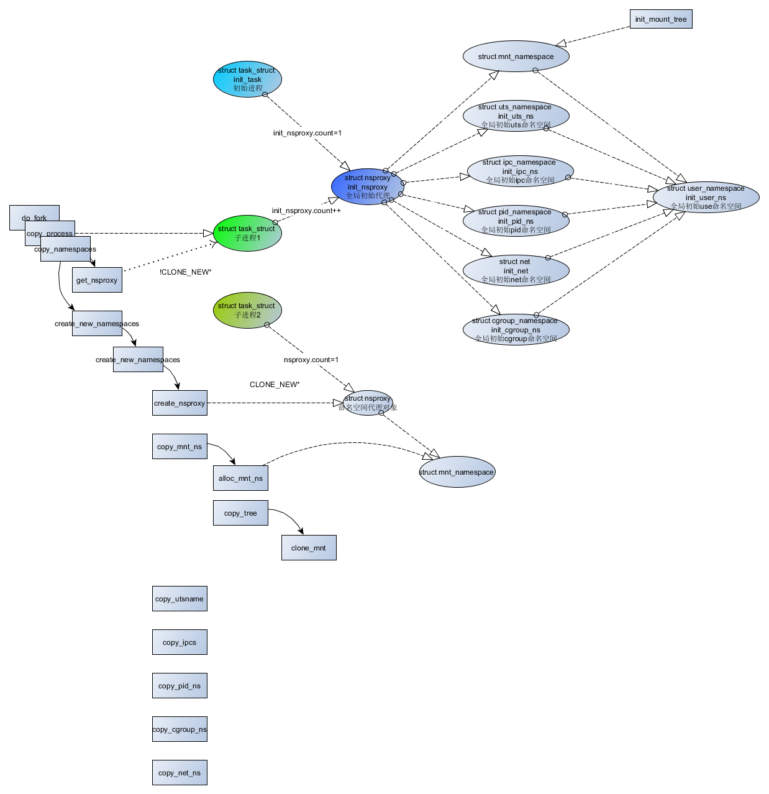

2. unshare() - 当前进程，创建并加入新的namwspace
3. setns() - 当前进程加入已有namespace
4. mount() - mount过程比较复杂且涉及文件系统的知识，这里不再累赘，详细内容请参考[Linux文件系统](Linux文件系统.md)

### namespaces命名空间 - 进程所看到的视图 ###

1. UTS - CLONE_NEWUTS,命名空间间hostname主机名隔离,始于Linux2.4.19
1. IPC - CLONE_NEWIPC,隔离System V IPC objects和POSIX message queues,始于Linux2.6.19
1. PID - CLONE_NEWPID，命名空间间的进程PID隔离，始于Linux2.6.24
1. NS - CLONE_NEWNS，挂载点隔离，始于Linux2.4.19
1. NET - CLONE_NEWNET，网络隔离，始于Linux2.6.29
1. USER - SCLONE_NEWUSER，虚拟user-id映射到真实的user-id，始于Linux3.8

*通过proc文件系统可以查看对namespace及cgroup的支持程度及相关**ID**,这个ID很重要，唯一标识命名空间及cgroup组，用户程序也使用ID*

#### UTS命名空间 ####

#### IPC命名空间 ####
IPC相关知识，请参考[Linux进程间通信](./Linux进程间通信.md)，*内核（全局）范围归IPC命名空间隔离*

#### mount命名空间 ####
##### 支持的文件系统、挂接情况 #####

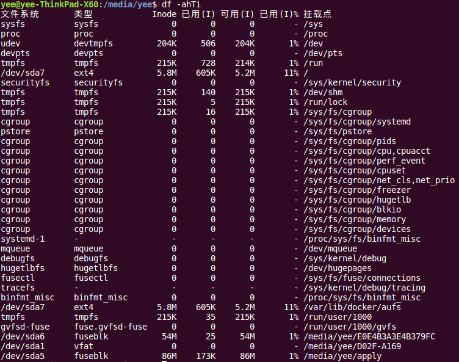

*包含windows分区，文件系统机制，请参考*[Linux文件系统](./Linux文件系统.md)

#### PID命名空间 ####
##### 预备知识 #####
1. PID命名空间可以嵌套，嵌套空间构成父子关系
1. 父空间里可以看到子孙空间的进程信息，反之则不可以
1. 空间里的第一个PID等于1,子空间也一样

*SPID会话ID，PGID工作组ID，PPID父进程ID，TGID线程组ID*

#### Network命名空间 ####

1. 主要提供了网络资源的隔离能力，包括网络设备、IPv4和IPv6协议栈、IP路由表、防火墙、/proc/net目录、/sys /class/net目录、端口（socket）等。

1. 网络命名空间的主要应用场景包括：1、多个网络命名空间可以拥有eth0和lo等网络设备；2、多个Apache服务器进程可以在不 同网络命名空间的80端口上进行监听；3、一个进程不能嗅探其他网络命名空间的流量；4、一个进程不能关闭其他网络命名空间的接口。

1. 后台进程可以运行在不同网络命名空间内的相同端口上，用户还可以自己虚拟出网卡。一个物理的网络设备最多存在于一个Network namespace中，你可以通过创建veth pair（虚拟网络设备对）在不同的Network namespace间创建通道进行通信。veth pair是用于不同Network namespace间进行通信的方式，veth pair将一个Network namespace数据发往另一个Network namespace的veth。

### cgroups - 进程所能得到的资源配额 ###
- cgroup有什么用？
	- 限制进程组的资源数量（例如，memory子系统可以为进程组设定memory使用上限，一旦进程组使用的内存达到限额再申请内存，就会出发OOM）；
	- 进程组的优先级控制（例如，可以使用cpu子系统为某个进程组分配特定cpu share）；
	- 记录进程组使用的资源数量（例如，cpuacct子系统记录某个进程组使用的cpu时间）；
	- 进程组隔离（例如，ns子系统可以使不同的进程组使用不同的namespace）；
	- 进程组控制（例如，freezer子系统可以将进程组挂起和恢复）；
- cgroup容易混淆的地方
	- 一个子系统只能属于一个层级树；
	- 一个层级树可以包含多个子系统，例如cpu和cpuacct通常会被挂载在同个层级树中；
	- 一个进程可以属于多个层级树中（确切说是层级树的节点中）
	- 层级树的节点等同于进程组

#### cgroup文件系统 ####

- cgroup在proc中的信息：

	

	- subsys_name子系统名称（cgroupsubsys.h中定义了所有subsystem子系统）；
	- hierarchy，cgroup层级树id，如果多个子系统挂载在同个树，则id相同，但**一个子系统只能属于一个层级树**；（上图，cpu和cpuacct同为5，net_cls和net_prio同为6，说明两个子系统同时挂载在一个cgroup层级树上，也可以通过mount | grep cgroup或cat /proc/mounts查看子系统挂载情况）；
		
		
		
	- num_cgroups，进程组数或层级树上所有节点数（例如以cpuset子系统为例，4代表共有4个进程组包含root或节点，垂直扩展；而devices子系统，共有83个进程组，大多水平扩展）
		
		

	- enabled，1代表启动子系统

- /sys/fs/cgroup本身为tmpfs文件系统，下层目录挂载cgroup文件系统
	
	

#### cgroup子系统 ####
1. cpu子系统，限制进程的cpu使用率
1. cpuacct子系统，cpu使用报告
1. cpuset子系统，分配单独的cpu节点或者内存节点
1. memory子系统，限制memory使用量
1. blkio子系统，限制块设备io
1. devices子系统，控制进程访问某些设备
1. net_cls子系统，标记网络数据包，然后可以使用tc模块traffic control对数据包进行控制
1. freezer子系统，挂起或者恢复cgroup中的进程
1. ns子系统，不同cgroup下面的进程使用不同的namespace

#### cgroup工具 ####
- cgroup-bin工具集
	- /usr/sbin/cgclear
		- 删除层级树极其所有进程组
	- /usr/sbin/cgconfigparser
		- 解析cgconfig.conf文件和并挂载层级树
	- /usr/sbin/cgrulesengd
	- /usr/bin/cgcreate
		- 在包含指定子系统的层级树下创建进程组（例如 cgcreate -g cpu,cpuacct,memory 11111）
	- /usr/bin/cgdelete
		- 删除层级树下所有进程组（例如，cgdelete -r cpuset:/，删除cpuset子系统下所有进程组，但保留层级树及root进程组）
	- /usr/bin/cgclassify
		- 转移进程到其他进程组（例如，cgclassify -g subsystems:path_to_cgroup pidlist）
	- /usr/bin/cgexec
		- 直接在进程组中启动程序（例如，cgexec -g subsystems:path_to_cgroup command arguments，通常用于创建临时任务）
	- /usr/bin/lscgroup
		- 显示所有层级树的进程组列表，读取/sys/fs/cgroup下所有的目录，每个目录代表一个进程组
	- /usr/bin/lssubsys
		- 显示所有子系统信息，如所在的层级树，-a支持的子系统，-m子系统挂载情况
	- /usr/bin/cgsnapshot
		- 根据当前cgroup情况生成cgconfig.conf文件内容（例如，cgsnapshot -b .）
	- /usr/bin/cgset
		- 设置进程组信息（例如，cgset -r cpuset.cpus=0-1 cpu,memory:/，也可以通过echo）
	- /usr/bin/cgget
		- 显示进程组信息（例如，cgget -g cpuset:/，等于读取/sys/fs/cgroup/cpuset下所有文件的内容)

## network网络管理 ##

## storge driver存储管理 ##

## 容器编排 ##
### Docker三剑客 ###
> docker三剑客包含docker machine、docker swarm、docker compose分别用于主机管理、集群管理、容器编排，为容器的分布式应用提供了简单解决方案。

#### docker machine - [Doc](https://docs.docker.com/machine/overview/)、[Github](https://github.com/docker/machine) ####
> docker machine用于管理运行docker的主机，对于macos和windows操作系统来说，为了部署docker(deamon+client)还要创建虚拟主机host，因为这些系统原生不支持docker。这里借用Windows Containers[Docker Engine on Windows这篇文章](https://docs.microsoft.com/en-us/virtualization/windowscontainers/manage-docker/configure-docker-daemon),(Windows Server 2016已支持)/Hyper-V Containers(Windows 10)来说明linux/macos/windows运行容器的区别。

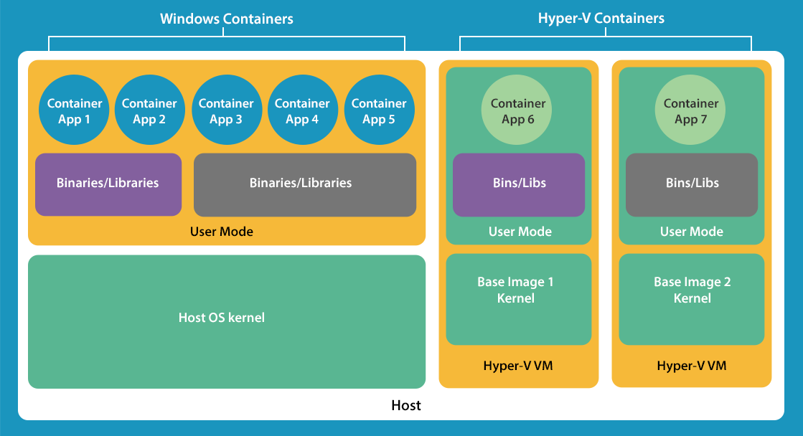

*Windows Server 2016下的Windows Container其实跟Linux Container类似都是原生支持,等同于Linux Host + docker + App*

*Windows 10下的Windows Container需要Hyper-V VM支持同时每个container需要安装windows的基本内核镜像，等同于Linux Host + KVM/XEN + Linux Guest + App*

#### docker swarm - [Doc](https://docs.docker.com/swarm/overview/)、[Github](https://github.com/docker/swarm) ####
> docker swarm通过把多个docker engine聚集在一起，形成一个大的docker engine，对外提供容器的集群服务，同时这个集群对外提供swarm API，用户可以像使用docker engine一样使用docker集群。

#### docker compose - [Doc](https://docs.docker.com/compose/overview/)、 [Github](https://github.com/docker/compose) ####

### Kubenets生态 ###

## lxc原生容器 ##

虚拟化技术对比

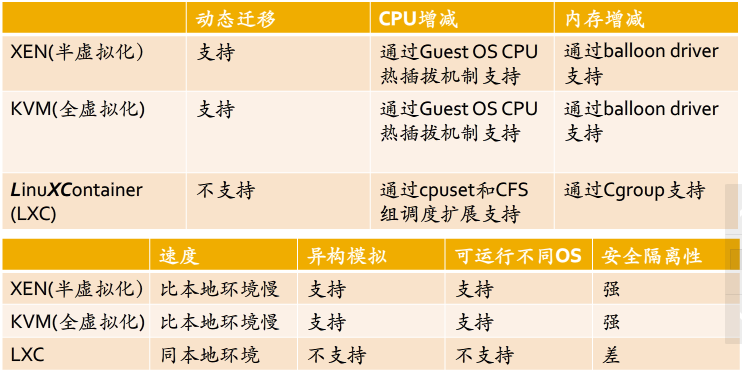

centos安装lxc

	yum -y install lxc lxc-templates bridge-utils lxc-libs libcgroup libvirt
	systemctl start libvirtd
	brctl show
	'/var/lib/lxc/u2/tmp_root_pass'
	chroot /var/lib/lxc/u2/rootfs passwd

## 其他工具 ##
1. unshare
2. nsenter
3. hostname - uts工具
4. ipcmk - ipc工具，用于创建共享内存、消息队列、信号量ipc资源
5. ipcs - ipc工具，与ipcmk配套用于查询ipc资源
6. iproute2工具
7. mininet

## 资料汇总
1. [Container (virtualization) from Wikipedia, the free encyclopedia](https://en.wikipedia.org/wiki/Container_(virtualization))
2. [Docker from 百度百科](https://baike.baidu.com/item/Docker/13344470?fr=aladdin)
3. [简述KVM架构和Xen架构](https://www.cnblogs.com/Timesi/p/9565456.html)
4. [学习 KVM 的系列文章](http://www.cnblogs.com/sammyliu/p/4543110.html)
5. [kuberbets中文文档](http://docs.kubernetes.org.cn/)
6. [Install Minikube](https://kubernetes.io/docs/tasks/tools/install-minikube/)
6. [Install and Set Up kubectl](https://kubernetes.io/docs/tasks/tools/install-kubectl/)