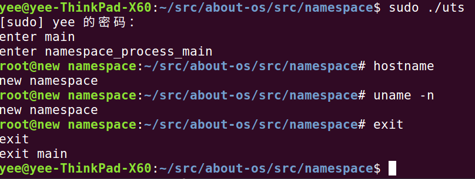
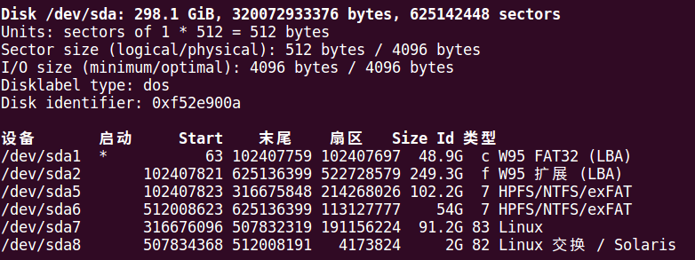
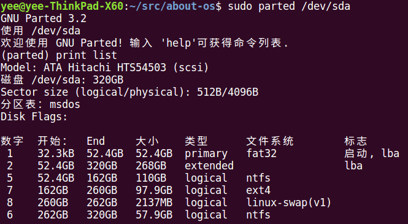
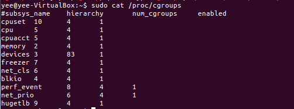
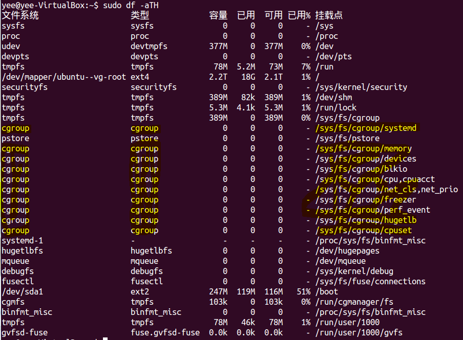
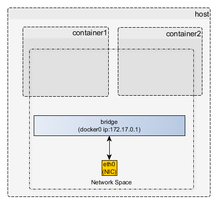
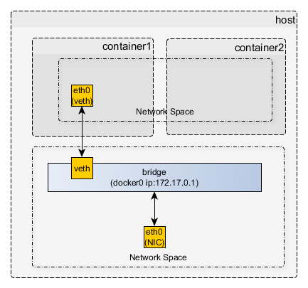
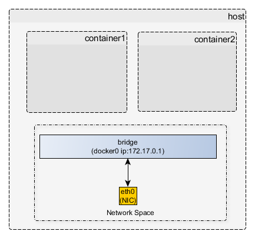

# Linux容器技术 #
Docker是虚拟化的一种轻量级替代技术。Docker的容器技术不依赖任何语言、框架或系统，可以将App变成一种标准化的、可移植的、自管理的组件，并脱离服务器硬件在任何主流系统中开发、调试和运行。

## Docker入门 ##

## Docker进阶 ##

## Docker高阶 ##
- namespaces命名空间 - *基于进程，提供环境的隔离，涉及[Linux进程管理](./Linux进程管理)、[Linux进程间通信](./Linux进程间通信)*
- cgroups控制组 - *基于cgroup文件系统，提供资源的隔离*
- AUFS层状文件系统 - *提供文件系统的隔离*

## namespaces命名空间 ##
### 空间类型 ###
1. UTS - CLONE_NEWUTS,命名空间间hostname主机名隔离,始于Linux2.4.19
1. IPC - CLONE_NEWIPC,隔离System V IPC objects和POSIX message queues,始于Linux2.6.19
1. PID - CLONE_NEWPID，命名空间间的进程PID隔离，始于Linux2.6.24
1. NS - CLONE_NEWNS，挂载点隔离，始于Linux2.4.19
1. NET - CLONE_NEWNET，网络隔离，始于Linux2.6.29
1. USER - SCLONE_NEWUSER，虚拟user-id映射到真实的user-id，始于Linux3.8

### 系统调用 ###
1. clone() - 创建进程，涉及进程管理知识请参考[Linux进程管理](Linux进程管理.md),与namespace相关部分，参考如下：

    

1. unshare() - 当前进程，创建并加入新的namwspace
1. setns() - 当前进程加入已有namespace

### proc文件系统 ###

*通过proc文件系统可以查看对namespace及cgroup的支持程度及相关**ID**,这个ID很重要，唯一标识命名空间及cgroup组，用户程序也使用ID*

### 用户程序 ###
1. unshare
1. nsenter
1. hostname - uts工具
1. ipcmk - ipc工具，用于创建共享内存、消息队列、信号量ipc资源
1. ipcs - ipc工具，与ipcmk配套用于查询ipc资源

### 实验 ###
#### UTS命名空间 ####

#### IPC命名空间 ####
IPC相关知识，请参考[Linux进程间通信](./Linux进程间通信.md)，*内核（全局）范围归IPC命名空间隔离*

##### 实验 #####

#### mount命名空间 ####
##### 支持的文件系统、挂接情况 #####

*包含windows分区，文件系统机制，请参考*[Linux文件系统](./Linux文件系统.md)

#### PID命名空间 ####
##### 预备知识 #####
1. PID命名空间可以嵌套，嵌套空间构成父子关系
1. 父空间里可以看到子孙空间的进程信息，反之则不可以
1. 空间里的第一个PID等于1,子空间也一样

*SPID会话ID，PGID工作组ID，PPID父进程ID，TGID线程组ID*

#### Network命名空间 ####

## cgroup控制组 ##
- cgroup有什么用？
	- 限制进程组的资源数量（例如，memory子系统可以为进程组设定memory使用上限，一旦进程组使用的内存达到限额再申请内存，就会出发OOM）；
	- 进程组的优先级控制（例如，可以使用cpu子系统为某个进程组分配特定cpu share）；
	- 记录进程组使用的资源数量（例如，cpuacct子系统记录某个进程组使用的cpu时间）；
	- 进程组隔离（例如，ns子系统可以使不同的进程组使用不同的namespace）；
	- 进程组控制（例如，freezer子系统可以将进程组挂起和恢复）；
- cgroup容易混淆的地方
	- 一个子系统只能属于一个层级树；
	- 一个层级树可以包含多个子系统，例如cpu和cpuacct通常会被挂载在同个层级树中；
	- 一个进程可以属于多个层级树中（确切说是层级树的节点中）
### cgroup文件系统 ###

- cgroup在proc中的信息：
	- subsys_name子系统名称；
	- hierarchy，cgroup层级树id，如果多个子系统挂载在同个树，则id相同，但**一个子系统只能属于一个层级树**；（上图，cpu和cpuacct同为5，net_cls和net_prio同为6，说明两个子系统同时挂载在一个cgroup层级树上，也可以通过mount | grep cgroup或cat /proc/mounts查看子系统挂载情况）；
				
	- num_cgroups，进程组数（例如以cpuset子系统为例，4代表共有4个进程组包含root或节点，垂直扩展；而devices子系统，共有83个进程组，大多水平扩展）
		
	- enabled，1代表启动子系统

- /sys/fs/cgroup本身为tmpfs文件系统，下层目录挂载cgroup文件系统

### cgroup子系统 ###
1. cpu子系统，限制进程的cpu使用率
1. cpuacct子系统，cpu使用报告
1. cpuset子系统，分配单独的cpu节点或者内存节点
1. memory子系统，限制memory使用量
1. blkio子系统，限制块设备io
1. devices子系统，控制进程访问某些设备
1. net_cls子系统，标记网络数据包，然后可以使用tc模块traffic control对数据包进行控制
1. freezer子系统，挂起或者恢复cgroup中的进程
1. ns子系统，不同cgroup下面的进程使用不同的namespace

### cgroup工具 ###
- cgroup-bin工具集
	- /usr/sbin/cgclear
	- /usr/sbin/cgconfigparser
	- /usr/sbin/cgrulesengd
	- /usr/bin/cgcreate
	- /usr/bin/cgclassify
	- /usr/bin/cgdelete
	- /usr/bin/cgexec
	- /usr/bin/lscgroup
	- /usr/bin/cgget
	- /usr/bin/lssubsys
	- /usr/bin/cgsnapshot
	- /usr/bin/cgset

## AUFS层状文件系统 ##

## docker实战 ##
### docker配置 ###

### docker命令 ###
1. docker info

    

1. docker pull

        docker pull [选项] [Docker Registry地址]<仓库名>:<标签>
                                   |              |        |
             <域名/IP>[:端口号],默认地址是Docker Hub     一个仓库中可能包含多个标签，例如ubuntu:14.04,ubuntu:16.04等
                                                  |        
                 <用户名>/<软件名>,不指定用户名，默认为官网的library(例如ubuntu，实际指向library/ubuntu)
    

### docker网络 ###

docker run创建Docker容器时，--net选项指定容器网络模式，Docker有以下4种网络模式：

- host模式，使用--net=host与主机相同，不创建独立的Network命名空间（网卡、路由、iptable规则等）；

  

- container模式，使用--net=container:NAME_or_ID，加入到指定容器使用的Network命名空间；

  

- none模式，使用--net=none，不设置网络；

  

- bridge模式，使用--net=bridge为默认模式，创建独立的Network命名空间，通过veth pair、网桥互联；
    
   

* 虚拟网卡veth、网桥等网络设备原理与实现，请参考*[Linux网络管理](./Linux网络管理.md)
