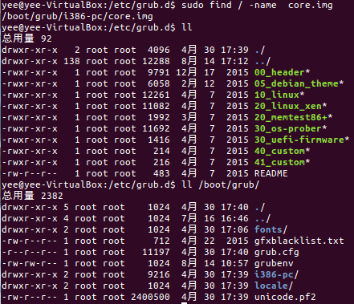

# Linux引导过程 #
## 第一个程序 - bootloader
### GRUB Legacy
#### 核心镜像core.img、配置grub.cfg及配套工具

## 编译内核
	apt-get source linux-image-$(uname -r)		#下载当前版本内核
## vmlinuz可引导的、压缩的内核（vmlinux未压缩）
	make zImage		#小内核，自带gzip解压代码，老的zImage解压缩内核到低端内存(第一个640K)
    make bzImage	#大内核，自带gzip解压代码，bzImage解压缩内核到高端内存(1M以上)
## initrd.img
## System.map内核符号表
	cat /boot/System.map | grep do_fork		#查看do_fork地址
## 初始化系统 - sysvinit
- service

        service 服务名 start/stop/status... #/etc/init.d/服务文件脚本（服务名）

- chkconfig

## 初始化系统 - systemd
## 内核信息
	cat /proc/cmdline
	cat /proc/kallsyms

## 启动参数
- 搜索__setup(

## 启动流程
- struct task\_struct init\_task = INIT\_TASK(init_task);
- union thread\_union init\_thread_union \_\_init\_task\_data = { INIT\_THREAD\_INFO(init\_task) };

- start\_kernel
	1. rest_init
		1. kernel\_thread(kernel\_init, NULL, CLONE_FS)，创建PID=1的进程
		2. kernel\_thread(kthreadd, NULL, CLONE\_FS | CLONE_FILES)，创建PID=2的进程
