# Linux磁盘管理 #

## 根目录/扩容(LVM，新增硬盘方式) ##
	du -m #查看文件系统及挂载点(文件系统列：内存文件系统/物理分区/逻辑卷)，根目录/空间为0，对应的是lvm逻辑卷，可以扩容
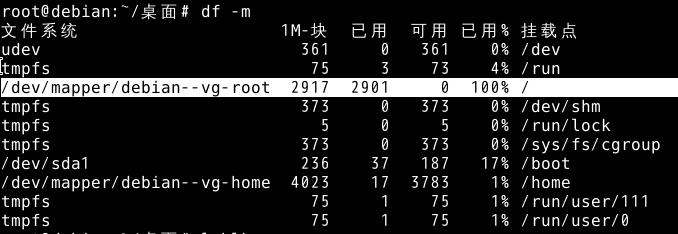

	lsblk #查看物理分区及lvm逻辑卷，树形结构

    fdisk -l #查看磁盘、物理分区及lvm逻辑卷

	加一块2T新硬盘，这里用virtualbox来模拟，实际情况类似

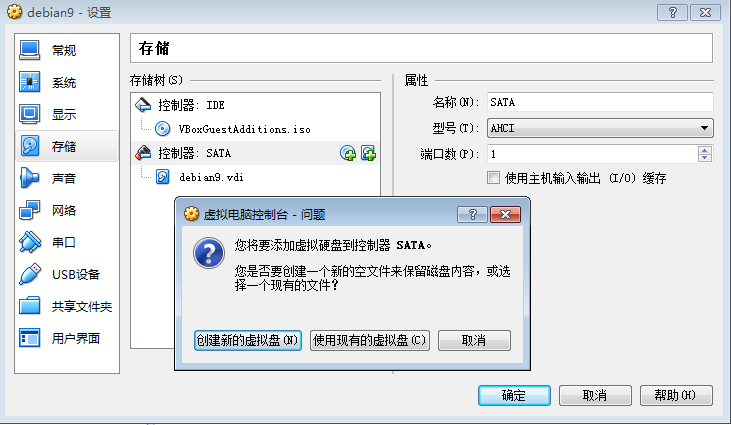
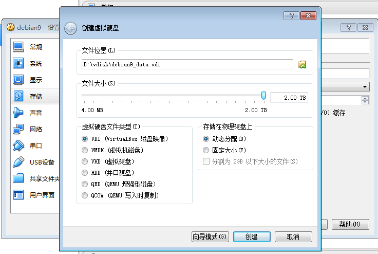

	fdisk -l #新增的2T新硬盘/dev/sdb，已经被OS识别

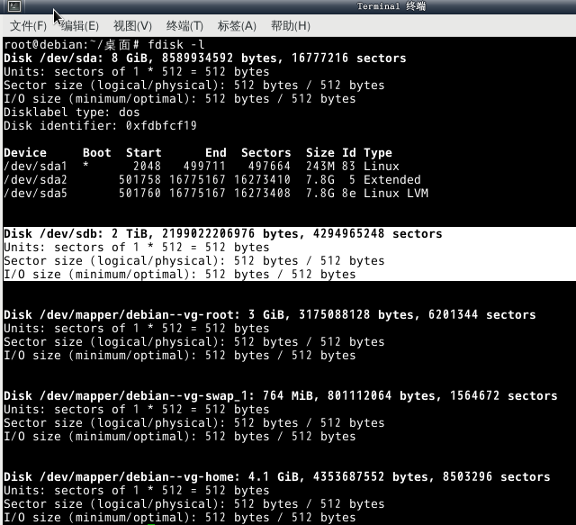

	fdisk /dev/sdb
	step1:n    #创建物理分区
    step2：p   #一个磁盘只能创建4个主分区，这里划分成2个分区，分别给/和/home扩容,选择主分区够了
    step3：+1T #选择1T大小
    step4：t   #更改分区类型，L查看所有类型
    step5：8e  #8e为linux lvm
	step6：w   #保存并写入

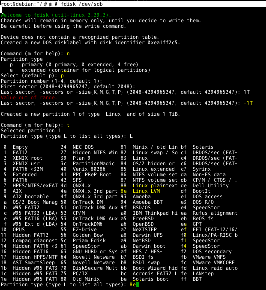

	fdisk -l   #再次确认结果

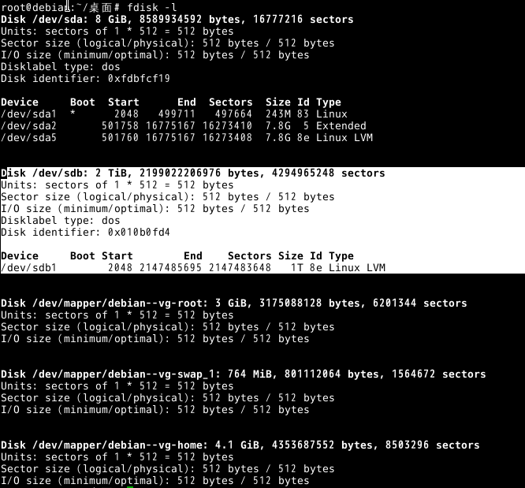

	fdisk /dev/sdb #对sdb剩余磁盘空间，创建新的lvm逻辑卷，步骤同上
	fdisk -l       #确认结果

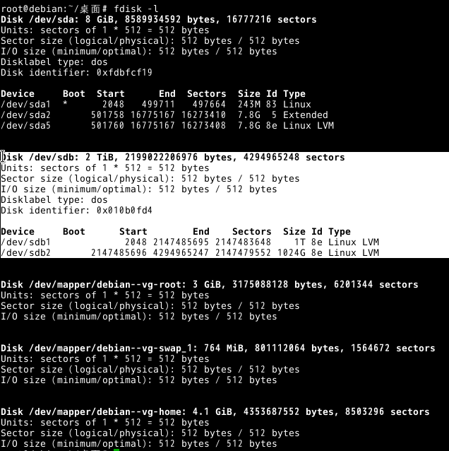

---

	至此，磁盘分区已经创建完成。下图是lvm卷层次图

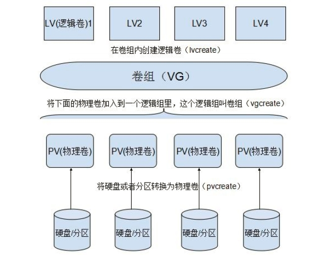

    逐层构建lvm

## 根目录/扩容(LVM，调整逻辑卷方式，缩容要严格遵守先调整文件系统层再调整设备层) ##
 
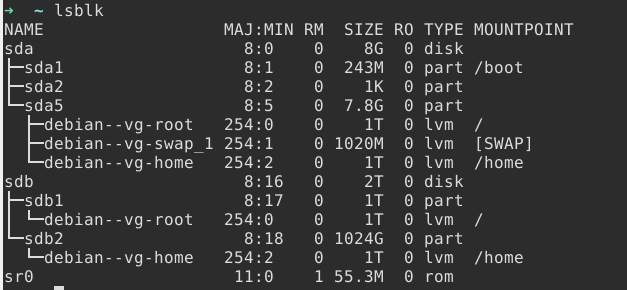

1. umount filesystem，卸载挂载点
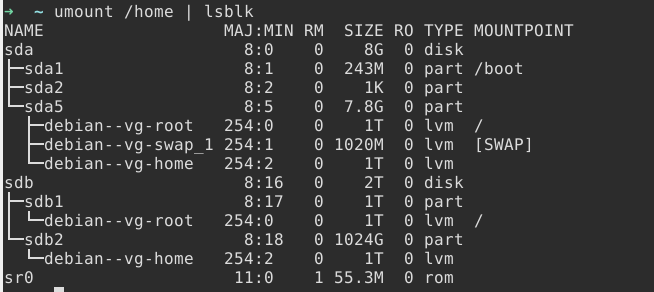

1. e2fsck filesystem，文件系统修复及校验

1. resize2fs filesystem，文件系统层home调整大小为512G，设备层依旧1T
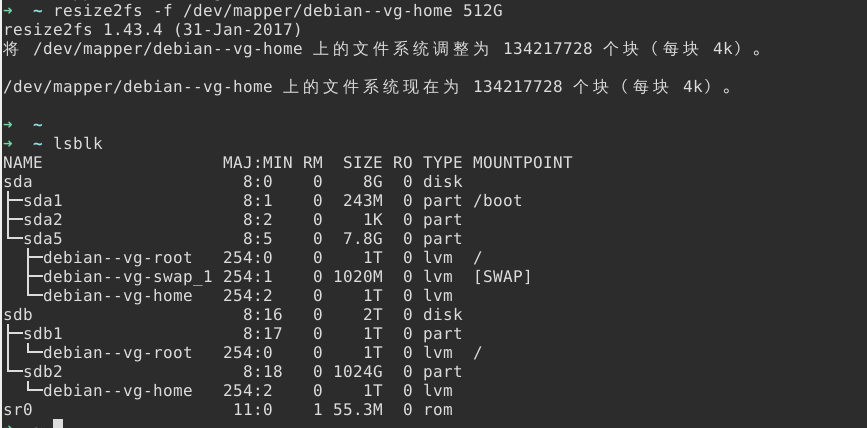

1. lvresize，设备层逻辑卷home缩容为512G

1. lvextend，设备层逻辑卷root扩容

1. resize2fs filesystem，文件系统层root调整大小并挂载
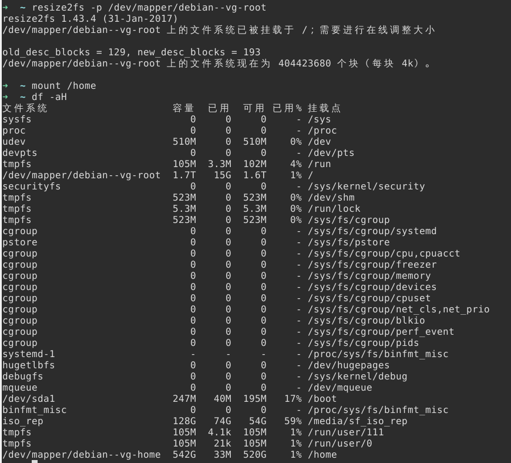