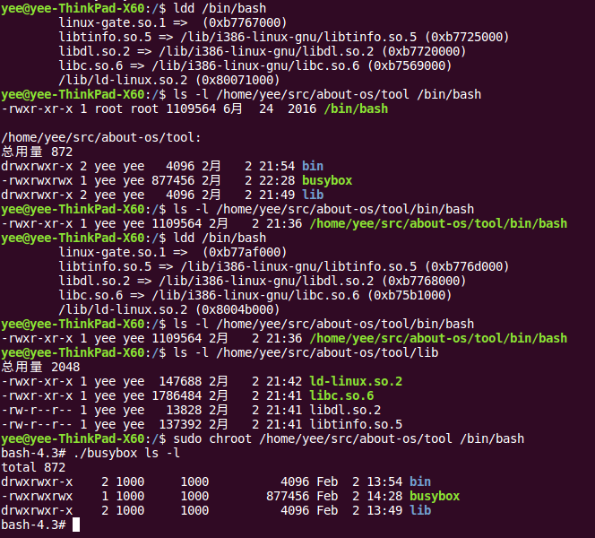

# Linux系统调用 #

## 系统调用分类 ##

一、进程控制：

函数 | 说明 | 简要流程及使用Demo
-------------|-------------|-------------
fork|	创建一个新进程|
clone|	按指定条件创建子进程|
execve|	运行可执行文件|
exit|	中止进程|
_exit|	立即中止当前进程|
getdtablesize|	进程所能打开的最大文件数|
getpgid|	获取指定进程组标识号|
setpgid|	设置指定进程组标志号|
getpgrp|	获取当前进程组标识号|
setpgrp|	设置当前进程组标志号|
getpid|	获取进程标识号|
getppid|	获取父进程标识号|
getpriority|	获取调度优先级|
setpriority|	设置调度优先级|
modify_ldt|	读写进程的本地描述表|
nanosleep|	使进程睡眠指定的时间|
nice|	改变分时进程的优先级|
pause|	挂起进程，等待信号|
personality|	设置进程运行域|
prctl|	对进程进行特定操作|
ptrace|	进程跟踪|
sched_get_priority_max|	取得静态优先级的上限|
sched_get_priority_min|	取得静态优先级的下限|
sched_getparam|	取得进程的调度参数|
sched_getscheduler|	取得指定进程的调度策略|
sched_rr_get_interval|	取得按RR算法调度的实时进程的时间片长度|
sched_setparam|	设置进程的调度参数|
sched_setscheduler|	设置指定进程的调度策略和参数|
sched_yield|	进程主动让出处理器,并将自己等候调度队列队尾|
vfork|	创建一个子进程，以供执行新程序，常与execve等同时使用|
wait|	等待子进程终止|
wait3|  参见wait|
waitpid|	等待指定子进程终止|
wait4|	参见waitpid|
capget|	获取进程权限|
capset|	设置进程权限|
getsid|	获取会晤标识号|
setsid|	设置会晤标识号|

二、文件系统控制

1、文件读写操作

函数 | 说明 | 简要流程及使用Demo
-------------|-------------|-------------
fcntl|	文件控制|
open|	打开文件|
creat|	创建新文件|
close|	关闭文件描述字|
read|	读文件|
write|	写文件|
readv|	从文件读入数据到缓冲数组中|
writev|	将缓冲数组里的数据写入文件|
pread|	对文件随机读|
pwrite|	对文件随机写|
lseek|	移动文件指针|
_llseek|	在64位地址空间里移动文件指针|
dup|	复制已打开的文件描述字|
dup2|	按指定条件复制文件描述字|
flock|	文件加/解锁|
poll|	I/O多路转换|
truncate|	截断文件|
ftruncate|	参见truncate|
umask|	设置文件权限掩码|
fsync|	把文件在内存中的部分写回磁盘|

2、文件系统操作

函数 | 说明 | 简要流程及使用Demo
-------------|-------------|-------------
access|	确定文件的可存取性|
chdir|	改变当前工作目录|
fchdir|	参见chdir|
chmod|	改变文件方式|
fchmod|	参见chmod|
chown|	改变文件的属主或用户组|
fchown|	参见chown|
lchown|	参见chown|
chroot|	改变根目录|
stat|	取文件状态信息|
lstat|	参见stat|
fstat|	参见stat|
statfs|	取文件系统信息|
fstatfs|	参见statfs|
readdir|	读取目录项|
getdents|	读取目录项|
mkdir|	创建目录|
mknod|	创建索引节点|
rmdir|	删除目录|
rename|	文件改名|
link|	创建链接|
symlink|	创建符号链接|
unlink|	删除链接|
readlink|	读符号链接的值|
mount|	安装文件系统|
umount|	卸下文件系统|
ustat|	取文件系统信息|
utime|	改变文件的访问修改时间|
utimes|	参见utime|
quotactl|	控制磁盘配额|

三、系统控制

函数 | 说明 | 简要流程及使用Demo
-------------|-------------|-------------
ioctl|	I/O总控制函数|
_sysctl|	读/写系统参数|
acct|	启用或禁止进程记账|
getrlimit|	获取系统资源上限|
setrlimit|	设置系统资源上限|
getrusage|	获取系统资源使用情况|
uselib|	选择要使用的二进制函数库|
ioperm|	设置端口I/O权限|
iopl|	改变进程I/O权限级别|
outb|	低级端口操作|
reboot|	重新启动|
swapon|	打开交换文件和设备|
swapoff|	关闭交换文件和设备|
bdflush|	控制bdflush守护进程|
sysfs|	取核心支持的文件系统类型|
sysinfo|	取得系统信息|
adjtimex|	调整系统时钟|
alarm|	设置进程的闹钟|
getitimer|	获取计时器值|
setitimer|	设置计时器值|
gettimeofday|	取时间和时区|
settimeofday|	设置时间和时区|
stime|	设置系统日期和时间|
time|	取得系统时间|
times|	取进程运行时间|
uname|	获取当前UNIX系统的名称、版本和主机等信息|
vhangup|	挂起当前终端|
nfsservctl|	对NFS守护进程进行控制|
vm86|	进入模拟8086模式|
create_module|	创建可装载的模块项|
delete_module|	删除可装载的模块项|
init_module|	初始化模块|
query_module|	查询模块信息|
*get_kernel_syms|	取得核心符号,已被query_module代替|

四、内存管理

函数 | 说明 | 简要流程及使用Demo
-------------|-------------|-------------
brk|	改变数据段空间的分配|
sbrk|	参见brk|
mlock|	内存页面加锁|
munlock|	内存页面解锁|
mlockall|	调用进程所有内存页面加锁|
munlockall|	调用进程所有内存页面解锁|
mmap|	映射虚拟内存页|
munmap|	去除内存页映射|
mremap|	重新映射虚拟内存地址|
msync|	将映射内存中的数据写回磁盘|
mprotect|	设置内存映像保护|
getpagesize|	获取页面大小|
sync|	将内存缓冲区数据写回硬盘|
cacheflush|	将指定缓冲区中的内容写回磁盘|

五、网络管理

函数 | 说明 | 简要流程及使用Demo
-------------|-------------|-------------
getdomainname|	取域名|
setdomainname|	设置域名|
gethostid|	获取主机标识号|
sethostid|	设置主机标识号|
gethostname|	获取本主机名称|
sethostname|	设置主机名称|

六、socket控制

函数 | 说明 | 简要流程及使用Demo
-------------|-------------|-------------
socketcall|	socket系统调用|
socket|	建立socket|
bind|	绑定socket到端口|
connect|	连接远程主机|
accept|	响应socket连接请求|
send|	通过socket发送信息|
sendto|	发送UDP信息|
sendmsg|	参见send|
recv|	通过socket接收信息|
recvfrom|	接收UDP信息|
recvmsg|	参见recv|
listen|	监听socket端口|
select|	对多路同步I/O进行轮询|
shutdown|	关闭socket上的连接|
getsockname|	取得本地socket名字|
getpeername|	获取通信对方的socket名字|
getsockopt|	取端口设置|
setsockopt|	设置端口参数|
sendfile|	在文件或端口间传输数据|
socketpair|	创建一对已联接的无名socket|

七、用户管理

函数 | 说明 | 简要流程及使用Demo
-------------|-------------|-------------
getuid|	获取用户标识号|
setuid|	设置用户标志号|
getgid|	获取组标识号|
setgid|	设置组标志号|
getegid|	获取有效组标识号|
setegid|	设置有效组标识号|
geteuid|	获取有效用户标识号|
seteuid|	设置有效用户标识号|
setregid|	分别设置真实和有效的的组标识号|
setreuid|	分别设置真实和有效的用户标识号|
getresgid|	分别获取真实的,有效的和保存过的组标识号|
setresgid|	分别设置真实的,有效的和保存过的组标识号|
getresuid|	分别获取真实的,有效的和保存过的用户标识号|
setresuid|	分别设置真实的,有效的和保存过的用户标识号|
setfsgid|	设置文件系统检查时使用的组标识号|
setfsuid|	设置文件系统检查时使用的用户标识号|
getgroups|	获取后补组标志清单|
setgroups|	设置后补组标志清单|

八、进程间通信

函数 | 说明 | 简要流程及使用Demo
-------------|-------------|-------------
ipc|	进程间通信总控制调用|

1、信号

函数 | 说明 | 简要流程及使用Demo
-------------|-------------|-------------
sigaction|	设置对指定信号的处理方法|
sigprocmask|	根据参数对信号集中的信号执行阻塞/解除阻塞等操作|
sigpending|	为指定的被阻塞信号设置队列|
sigsuspend|	挂起进程等待特定信号|
signal|	参见signal|
kill|	向进程或进程组发信号|
*sigblock|	向被阻塞信号掩码中添加信号,已被sigprocmask代替|
*siggetmask|	取得现有阻塞信号掩码,已被sigprocmask代替|
*sigsetmask|	用给定信号掩码替换现有阻塞信号掩码,已被sigprocmask代替|
*sigmask|	将给定的信号转化为掩码,已被sigprocmask代替|
*sigpause|	作用同sigsuspend,已被sigsuspend代替|
sigvec|	为兼容BSD而设的信号处理函数,作用类似sigaction|
ssetmask|	ANSI C的信号处理函数,作用类似sigaction|

2、消息

函数 | 说明 | 简要流程及使用Demo
-------------|-------------|-------------
msgctl|	消息控制操作|
msgget|	获取消息队列|
msgsnd|	发消息|
msgrcv|	取消息|

3、管道

函数 | 说明 | 简要流程及使用Demo
-------------|-------------|-------------
pipe|	创建管道|

4、信号量

函数 | 说明 | 简要流程及使用Demo
-------------|-------------|-------------
semctl|	信号量控制|
semget|	获取一组信号量|
semop|	信号量操作|

5、共享内存

函数 | 说明 | 简要流程及使用Demo
-------------|-------------|-------------
shmctl|	控制共享内存|
shmget|	获取共享内存|
shmat|	连接共享内存|
shmdt|	拆卸共享内存|

## 资料 ##
1. [Linux系统调用列表](http://www.ibm.com/developerworks/cn/linux/kernel/syscall/part1/appendix.html)