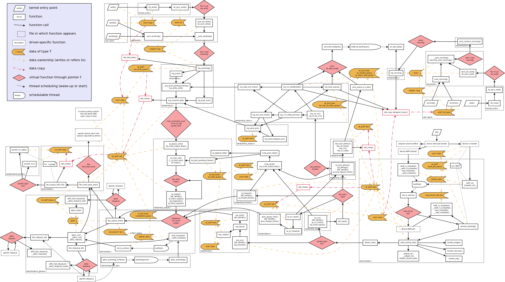

# Linux网络管理 #

## 网络协议 ##

## Linux网络实现及数据流 ##

## Linux网络IO模型 ##

## 网络设备 ##

### 网桥briage ###

### 虚拟以太网卡veth ###

### TUN/TAP ###

### bonding ###

  bonding的模式一共有7种，常用的为0、1两种：

- round-robin(balance-rr)  0  网卡的负载均衡模式
- active-backup  1 网卡的容错模式
- balance-xor  2 需要交换机支持
- broadcast  3 广播模式
- ieee802.3ad  4 动态链路聚合模式，需要交换机支持
- mode-tlb  5 自适应模式
- mode-alb  6 网卡虚拟化方式

## 网络IO模型及编程 ##
- blocking 同步阻塞式I/O
	
	默认情况下,所有套接口都是阻塞的
		
	

	单进程模型             |  多线程/进程模式
	:-------------------------:|:-------------------------:
	  |  

- nonblocking 同步非阻塞式I/O

	

- multiplexing I/O多路复用(select/poll/epoll)

- signal driven 信号驱动式I/O(SIGIO)

- asynchronous 异步I/O(POSIX的aio_系列函数)

## 管理工具 ##
- ifconfig
- ethtool
- iwconfig
- tcpdump
- netstat
- ping
- hostname
- ip
