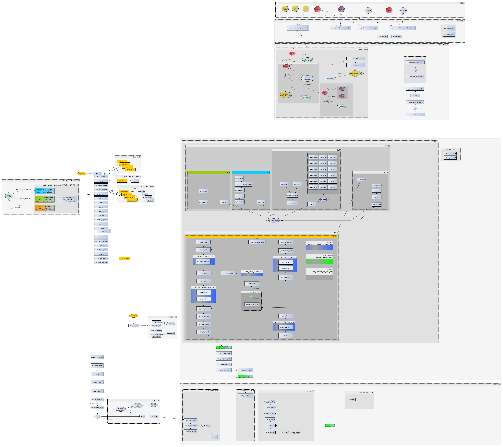
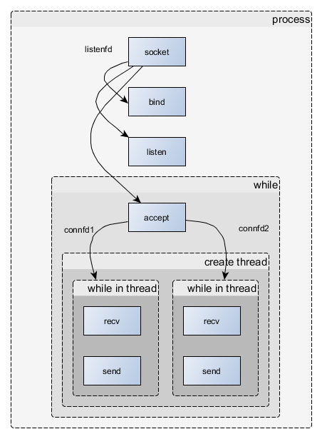
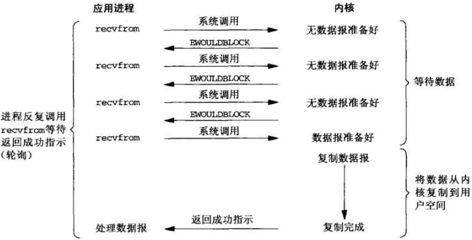

# Linux网络管理 #

## 网络协议 ##

## Linux网络实现及数据流 ##

## Linux网络IO模型 ##

## 网络协议栈各部分初始化 ##
- **core_initcall：sock\_init初始，网络协议运行环境初始化**
	- net\_sysctl\_init，初始化网络相关系统控制参数sysctl，机制部分详见[Linux系统控制参数sysctl](Linux系统控制参数sysctl.md)
	- skb_init，创建socket buffer slab缓存
	- init_inodecache，创建socket伪文件系统的inode缓存sock_inode_cachep
	- register_filesystem，注册socket文件系统sockfs
	- kern_mount，挂载sockfs文件系统
	- ptp_classifier_init
- **fs\_initcall：inet\_init，网络协议初始化**
	- (void)sock_register(&inet_family_ops)，注册Internet协议族，放入全局net\_families，socket系统调用会利用inet\_family\_ops->create来创建socket句柄和内部sock对象
- **subsys\_initcall：net\_dev_init，网络子系统初始化**
	- dev\_proc_init
	- netdev\_kobject_init
	- register\_pernet_subsys
	- for\_each\_possible\_cpu
		- 初始化per\_cpu接收队列softnet\_data
- **device\_initcall：设备驱动初始化**

备注：core\_initcall/fs\_initcall等为初始化宏，级别越高越早初始化,详见[Linux引导过程](Linux引导过程.md)

## 系统调用层（net\socket.c） ##
- socket创建套接口，同时创建了sock对象、socket对象，file对象及fd
	- SYSCALL_DEFINE3(socket, int, family, int, type, int, protocol)
		- sock_create
			- __sock\_create，创建socket对象和sock对象，sock封装在socket中返回
				- sock_alloc，创建socket对象
				- =============协议相关开始,以IPv4协议族为例============
				- 通过family or domain(协议族或协议域，应用层传入)从全局对象net_families中找到net_proto_family对象（例如：IPv4协议族，AF\_INET,inet_family_ops）
				- 调用net_proto_family.create创建sock对象（例如：IPv4协议族，实际调用inet_create）
					- sk_alloc，创建sock对象
					- inet_sk，sock对象转成子对象inet_sock对象
					- sock_init_data，初始化sock对象，并与socket对象建立关系
		- sock_map_fd，把socket对象封装到file对象
			- fd_install，file对象映射到fd，并返回fd

## 网络设备 ##

### 网桥bridge ###

### 虚拟以太网卡veth ###

### TUN/TAP ###

### bonding ###

  bonding的模式一共有7种，常用的为0、1两种：

- round-robin(balance-rr)  0  网卡的负载均衡模式
- active-backup  1 网卡的容错模式
- balance-xor  2 需要交换机支持
- broadcast  3 广播模式
- ieee802.3ad  4 动态链路聚合模式，需要交换机支持
- mode-tlb  5 自适应模式
- mode-alb  6 网卡虚拟化方式

## 网络IO模型及编程 ##
- blocking 同步阻塞式I/O
	
	默认情况下,所有套接口都是阻塞的
		
	

	单进程模型             |  多线程/进程模式 | 线程/进程池模式
	:-------------------------:|:-------------------------:|:-------------------------:
	  |   |  

	1. 通过多线程/进程模式**解决了多连接阻塞问题**，连接用的accept函数在主进程中，把影响（指阻塞）accept的数据交互部分（recv和send）移到子线程/进程中，这样就不会阻塞连接也不会阻塞其他子线程/进程收发数据，是一种被动规避方案
	2. 多线程/进程模式下，虽然一定程度上解决了连接问题，但大量连接情况下会导致大量的线程/进程开销
	3. 线程/进程池模式，解决在一定程度上解决了连接问题和开销问题，但同样存在“池”大小选择问题，过大过小都不合适
	4. 上面两种模式，线程/进程中没有使用非阻塞I/O，因为没有必要

- nonblocking 同步非阻塞式I/O

	

- multiplexing I/O多路复用(select/poll/epoll)

	

- signal driven 信号驱动式I/O(SIGIO)

	

- asynchronous 异步I/O(POSIX的aio_系列函数)

	

## 管理工具 ##
- ifconfig
- ethtool
- iwconfig
- tcpdump
- netstat
- ping
- hostname
- ip
