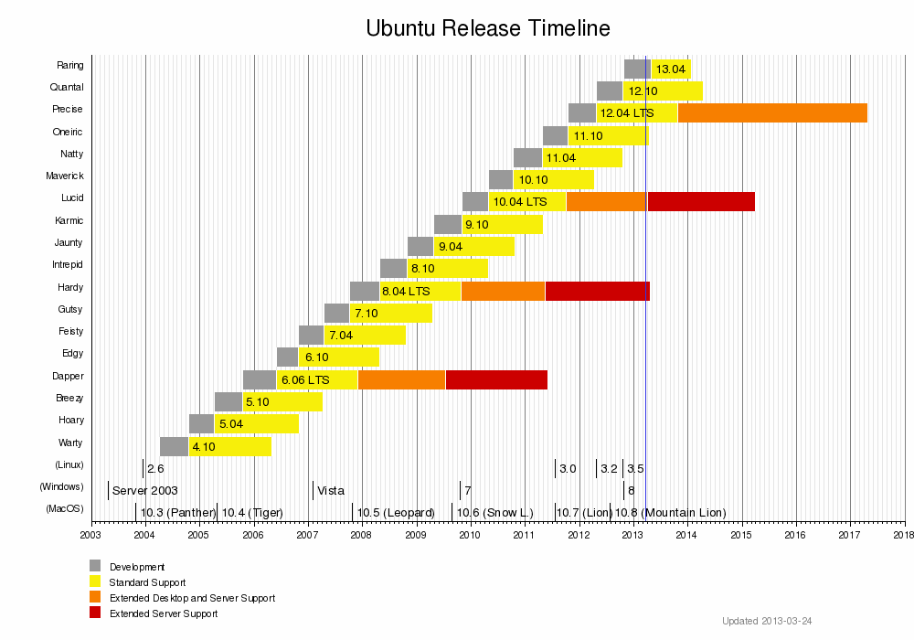

# Linux软件包管理 #

## Debian/Ubuntu APT包管理
### 源服务器目录结构

- pool存放实际的安装包及源码
- dists目录下包含各种ubuntu发布版本名称：

		Ubuntu 4.10 – Warty Warthog （多疣的疣猪）
		Ubuntu 5.04 – Hoary Hedgehog （白发的刺猬）
		Ubuntu 5.10 – Breezy Badger （活泼的獾）
		Ubuntu 6.06 – Dapper Drake （整洁的公鸭）　　LTS版本
		Ubuntu 6.10 – Edgy Eft （尖利的小蜥蜴）
		Ubuntu 7.04 – Feisty Fawn （烦躁不安的小鹿）
		Ubuntu 7.10 – Gutsy Gibbon （胆大的长臂猿）
		Ubuntu 8.04 – Hardy Heron （坚强的苍鹭）　　LTS版本
		Ubuntu 8.10 – Intrepid Ibex （无畏的高地山羊）
		Ubuntu 9.04 – Jaunty Jackalope （活泼的兔子）
		Ubuntu 9.10 – Karmic Koala （幸运的无尾熊）
		Ubuntu 10.04 – Lucid Lynx （清醒的猞猁）　　LTS版本
		Ubuntu 10.10 – Maverick Meerkat （标新立异的的狐獴）
		Ubuntu 11.04 – Natty Narwhal （敏捷的独角鲸）
		Ubuntu 11.10 – Oneiric Ocelot （有梦的虎猫）
		Ubuntu 12.04 – Precise Pangolin （精准的穿山甲）　　LTS版本
	
       

		通过cat /ect/issue、uname -r、cat /proc/version查看发行版本、内核版本及体系结构
       版本名称目录下包含4种软件包类别：

	- main : 官方支持的软件包，main目录下包含各种体系结构：binary-i386等等，体系结构(binary-i386)目录下包含软件包deb文件，并且第一个体系结构目录下都有一个Packages.gz文件。
	- restricted :受限（许可证）支持软件包
	- universe :社区支持软件包，非官方支持软件包
	- multiverse :收费软件包

### apt相关配置及目录
- /etc/apt/sources.list，apt软件源配置文件

	deb http://us.archive.ubuntu.com/ubuntu/ hardy main restricted

	deb-src http://us.archive.ubuntu.com/ubuntu/ hardy main restricted

- /var/lib/dpkg/available，文件的内容是软件包的描述信息
- /var/cache/apt/archives， apt-get install 安装软件时，软件包的临时目录
- var/lib/apt/lists，apt-get update命令会从/etc/apt/sources.list中下载软件列表，并保存到该目录

### 本地apt系列命令
- apt-get update，获取源服务器（/etc/apt/sources.list中配置源服务器）软件包列表（Packages.gz）
- apt-get download pkgnames，下载软件包到当前目录
- apt-get install pkgnames，下载（临时目录/var/cache/apt/archives）并安装软件包，apt-get的GUI版本是synaptic包管理器（apt-get install synaptic），apt-get clean用于清除临时目录下的安装包
- apt-get upgrade，依赖关系变更时，拒绝更新软件包，否则仅更新本软件包，不更新依赖
- apt-get dist-upgrade，更新已有的软件包，同时更新依赖（根据依赖关系的变化，添加包，删除包）
- apt-file search 文件名 | grep bin，查看文件名查找软件包
- apt-cache pkgnames， 列出所有可安装软件包
- apt-get remove pkgnames，移除软件包不包括其依赖
- apt-get autoremove pkgnames，移除软件包包括其依赖
- apt-cache depends，查看软件包依赖，，从var/lib/apt/lists目录*_Packages读取信息，来源于源服务器Packages.gz
- apt-cache search 关键字，通过关键字查找软件包，从var/lib/apt/lists目录*_Packages读取信息，来源于源服务器Packages.gz
- apt-cache show pkgnames，显示软件包基本信息，从var/lib/apt/lists目录*_Packages读取信息，来源于源服务器Packages.gz
- apt-cache stats，显示缓存统计
- apt-get install pkgnames --only-upgrade，更新指定软件包
- apt-get purge pkgnames，删除软件包配置，apt-get remove --purge pkgnames
- apt-get changelog pkgnames，软件包的更新日志
- apt-get check，显示损坏的依赖关系
- sudo add-apt-repository ppa:[jonathonf/vim],添加ppa软件，然后使用apt-get update命令获取软件包列表，最后使用apt-get install [vim]安装软件
http://ppa.launchpad.net/jonathonf/vim/ubuntu

### 本地dpkg命令
- dpkg -I pkg.deb#查看软件包的详细信息，包括软件名称、版本以及大小等（其中-I等价于--info）
- dpkg -c pkg.deb#查看软件包中包含的文件结构（其中-c等价于--contents）
- dpkg -i pkg.deb#安装软件包（其中-i等价于--install）
- dpkg -l pkg#查看软件包的信息（软件名称可通过dpkg -I命令查看，其中-l等价于--list）
- dpkg -L pkg#查看软件包安装的所有文件（软件名称可通过dpkg -I命令查看，其中-L等价于--listfiles）
- dpkg -s pkg#查看软件包的详细信息（软件名称可通过dpkg -I命令查看，其中-s等价于--status）
- dpkg -r pkg#卸载软件包（软件名称可通过dpkg -I命令查看，其中-r等价于--remove）
- dpkg -S file 查看文件所属deb包

    注：dpkg命令无法自动解决依赖关系。如果安装的deb包存在依赖包，则应避免使用此命令，或者按照依赖关系顺序安装依赖包。

### 附加工具
- apt-fast，apt-get替代品
- apt-spy，寻找最快源服务器
- dpkg-scanpackages，搜索指定目录（可以为/var/cache/apt/archives）下的deb包并且把包的信息写入Packages.gz，方便搭建自己的源服务器
- dselect, console-apt, aptitude, gnome-apt图形前端

### 参考资料
1. To build a mirror with debmirror follow these steps，https://help.ubuntu.com/community/Debmirror
2. Repositories/CommandLine，https://help.ubuntu.com/community/Repositories/CommandLine
3. ubuntu在局域网内的安装－－建立自己的DEB源服务器，http://forum.ubuntu.org.cn/viewtopic.php?t=65823
4. Ubuntu Sources List Generator，https://repogen.simplylinux.ch/
5. 在Ubuntu下搭建自己的源服务器,http://www.linuxdiyf.com/linux/18423.html