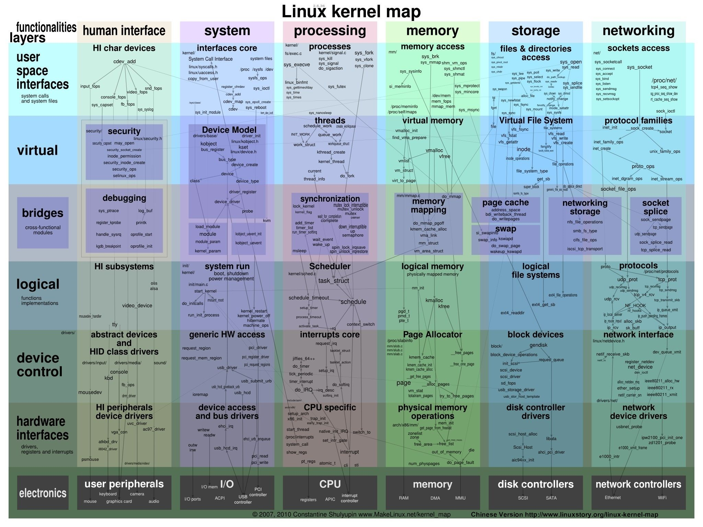
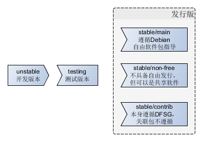

# 有关Linux
*-----Linux学习笔记*

## 一、有关Linux内核

---

[Linux引导过程](./Linux引导过程.md)、[Linux进程管理](./Linux进程管理.md)、[Linux内存管理](./Linux内存管理.md)、[Linux文件系统](./Linux文件系统.md)、[Linux网络管理](./Linux网络管理.md)、[Linux设备管理](./Linux设备管理.md)、[Linux虚拟化技术](./Linux虚拟化技术.md)、[Linux容器技术](./Linux容器技术.md)、[Linux调试及跟踪](./Linux工具集.md)

---

## 二、有关Linux运维

---

[Linux软件包管理](./Linux软件包管理.md)

---

###shell内置命令
    sh -n xxx.sh       	#检查语法
	sh -vx xxx.sh		#运行跟踪
	touch file			#创建文件
	cp file1 file2				#拷贝文件，有些比较强大的选项，例如-R递归拷贝，-P保留原有时间
    mv name1 name2		#修改名字
    rm 	 file/dir		#删除文件或目录，-rf递归强制删除
	mkdir dir		#创建目录，rmdir dir可以删除空目录
    stat file		#查看文件统计信息
    file name		#查看文件类型，类型分为：文本文件、可执行文件、数据文件
    cat file		#查看文件内容，-b显示行号，-T不显示制表符
    head/tail file		#查看部分文件内容
    more/less		#分屏显示

	ps		#显示进程信息，最复杂的命令之一，支持三种风格选项，Unix、BSD、GNU
	top		#实时显示进程信息
    kill pid		#例如发送KILL无条件终止信号，kill -9 pid or kill -s KILL pid
    killall pidname	#通杀所有进程，支持通配符

	printenv	#打印所有全局环境变量
	set		#显示特定进程所有变量，包括局部环境变量和全局环境变量
    unset var		#删除环境变量
    var=value		#设置局部环境变量，通常用小写字母，用于区分全局变量
    echo $var		#显示变量的值
    export var		#导到全局环境中，这样所有shell进程中都可见

###debian/ubuntu软件包管理

###键盘布局
	loadkeys "keymap_name"		#键盘布局，ubuntu：/usr/share/ibus/keymaps

###硬盘分区

###网络配置，参见“http://wiki.ubuntu.org.cn/UbuntuManual:网络设置”

###个性化定制
    xset dpms force off #系统>设置->键盘->快捷键alt+c
    gnome-terminal      #系统>设置->键盘->快捷键alt+r
    对选区截图           #系统>设置->键盘->快捷键alt+print
    最大化窗口
    
###服务器安装及配置
- ssh
- vnc

##有关Linux工具
###Ftrace(>=2.6.27，Documentation/ftrace.txt)
	$sudo su							#切换到root
    $cd /sys/kernel/debug/tracing		#存在，表明支持Ftrace
    $cat available_tracers				#该内核支持的trace类
    $sudo apt-get install trace-cmd		#Ftrace前端命令工具
    $sudo apt-get install kernelshark	#Ftrace可视化前端工具

##资料
- [SysVinit (简体中文)] (https://wiki.archlinux.org/index.php/SysVinit_\(简体中文\))
- UNIX Linux系统管理技术手册（第4版）
- Linux命令行与Shell脚本编程大全