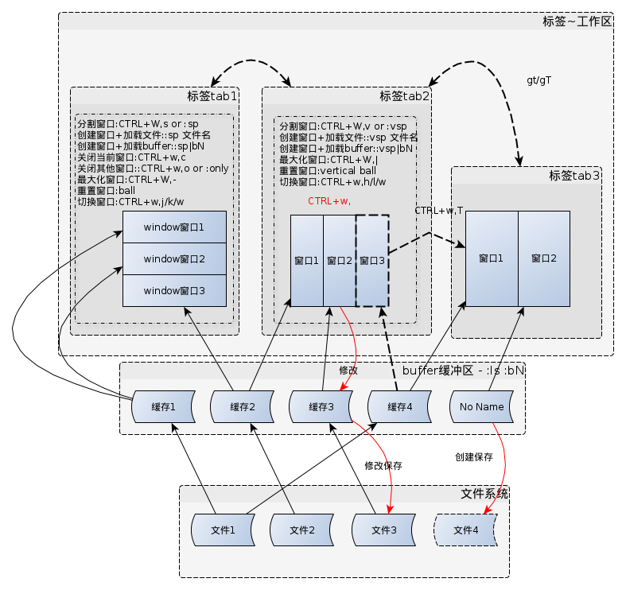

# vim设计
## 文本层 - 基本配置

buffer,window,tab关系

### buffer

  * buffer创建
  * buffer删除或关闭,:bd
  * buffer切换
  * buffer焦点

### window
  * window创建
  * window删除或关闭
  * window重排
  * window切换,ctrl+w w
  * window最大化,ctrl+w |/_

### tab
  * tab创建
  * tab删除或关闭
  * tab重排
  * tab获取焦点

### 移动光标

### 文件内搜索 - 移动光标的一种方式
  * ?word or /word直接搜索, 快捷方式*
  * [I搜索结果,放入窗口
  * :set hlsearch配置高亮
  * :set ignorecase配置忽略大小写
  * :set smartcase配置智能搜索
  * :set incsearch配置递进搜索
  * :set wrapscan配置环形搜索
  * ctrl+r ctrl+w获取当前光标下的word

### 编辑文字

#### 拷贝

#### 删除

#### 粘帖

### 替换 - 编辑文字的一种方式

### 折叠
  * zc,折叠
  * zo,张开

### 主题管理

## 语义层 - 按IDE标准来设计,不同语言会有所不同

### 项目管理

#### 文件管理

### 项目搜索

### 补全

## 快捷键管理
